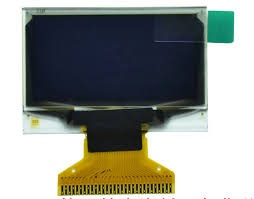

CircuitPython SH1106 Driver
===========================

|version| |ci| |license_type|

CircuitPython driver for SH1106 OLED displays.

This driver is based on the SSD1306 driver in the MicroPython source but differs
by supporting hardware I2C interfaces and Adafruit CircuitPython API.  For a
MicroPython machine API compatible library see: https://github.com/adafruit/micropython-adafruit-ssd1306

Dependencies
=============
This driver depends on:

* `Adafruit CircuitPython <https://github.com/adafruit/circuitpython>`_
* `Bus Device <https://github.com/adafruit/Adafruit_CircuitPython_BusDevice>`_

Please ensure all dependencies are available on the CircuitPython filesystem.
This is easily achieved by downloading
`the Adafruit library and driver bundle <https://github.com/adafruit/Adafruit_CircuitPython_Bundle>`_.

Usage Example
=============

.. code-block:: python3

  # Basic example of clearing and drawing pixels on a SSD1306 OLED display.
  # This example and library is meant to work with Adafruit CircuitPython API.
  # Author: Mark Winney heavily based on SSD1036 driver by Tony DiCola
  # License: Public Domain

  # Import all board pins.
  from board import SCL, SDA
  import busio

  # Import the SH1106 module.
  import sh1106

  # Create the I2C interface.
  i2c = busio.I2C(SCL, SDA)

  # Create the SH1106 OLED class.
  # The first two parameters are the pixel width and pixel height.  Change these
  # to the right size for your display!
  display = sh1106.SH1106_I2C(128, 32, i2c)
  # Alternatively you can change the I2C address of the device with an addr parameter:
  #display = sh1106.SH1106_I2C(128, 32, i2c, addr=0x3c)

  # Clear the display.  Always call show after changing pixels to make the display
  # update visible!
  display.fill(0)

  display.show()

Contributing
============

Contributions are welcome! Please read our `Code of Conduct
<https://github.com/winneymj/CircuitPython_SH1106/blob/master/CODE_OF_CONDUCT.md>`_
before contributing to help this project stay welcoming.

Building locally
================

Zip release files
-----------------

To build this library locally you'll need to install the
`circuitpython-build-tools <https://github.com/adafruit/circuitpython-build-tools>`_ package.

.. code-block:: shell

    python3 -m venv .env
    source .env/bin/activate
    pip install circuitpython-build-tools

Once installed, make sure you are in the virtual environment:

.. code-block:: shell

    source .env/bin/activate

Then run the build:

.. code-block:: shell

    circuitpython-build-bundles --filename_prefix circuitpython-sh1106 --library_location .

Sphinx documentation
-----------------------

Sphinx is used to build the documentation based on rST files and comments in the code. First,
install dependencies (feel free to reuse the virtual environment from above):

.. code-block:: shell

    python3 -m venv .env
    source .env/bin/activate
    pip install Sphinx sphinx-rtd-theme

Now, once you have the virtual environment activated:

.. code-block:: shell

    cd docs
    sphinx-build -E -W -b html . _build/html

This will output the documentation to ``docs/_build/html``. Open the index.html in your browser to
view them. It will also (due to -W) error out on any warning like Travis will. This is a good way to
locally verify it will pass.

License
-------

This project is licensed under the `MIT License <https://github.com/mmabey/CircuitPython_HCSR04/blob/master/LICENSE>`_.

.. |version| image:: https://img.shields.io/github/release/winneymj/CircuitPython_SH1106/all.svg
    :alt: Release Version
    :target: https://github.com/winneymj/CircuitPython_SH1106

.. |ci| image:: https://travis-ci.org/winneymj/CircuitPython_SH1106.svg
    :alt: CI Build Status
    :target: https://travis-ci.org/winneymj/CircuitPython_SH1106

.. |license_type| image:: https://img.shields.io/github/license/winneymj/CircuitPython_SH1106.svg
    :alt: License: MIT
    :target: `GitHub`_

.. _GitHub: https://github.com/winneymj/CircuitPython_SH1106

.. _CircuitPython: https://github.com/adafruit/circuitpython
